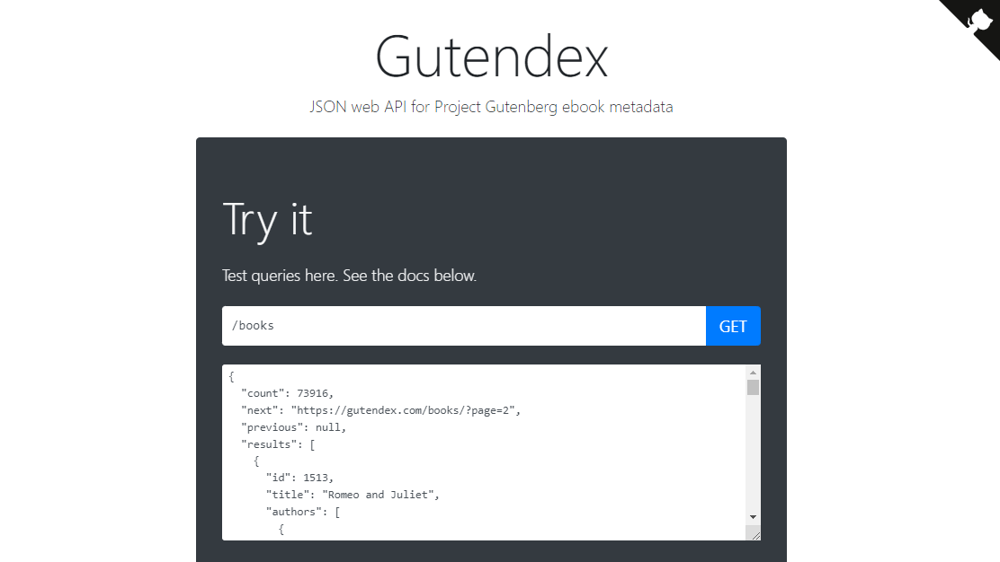

<strong># Challenge LiterAlura #</strong>

 

    <table style="margin: 0 auto;">
        <tr>
            <td style="text-align: center;">
                 
                <strong>Challenge LiterAlura</strong>
            </td>
            <td style="text-align: center;">
                 
                <strong>Alura</strong>
            </td>
            <td style="text-align: center;">
                 
                <strong>ONE</strong>
            </td>
        </tr>
    </table>

 

Challenge de la formación Backend de Alura Latam + Oracle "LiterAlura", donde vamos a construir un catálogo de libros usando Java, Spring y PostgreSQL   

<strong># Aplicación #</strong>

 

El desafío consiste en crear una aplicación de consola que permita a los usuarios: 
1   - Buscar un libro por título: La aplicación buscará el libro en una API llamada Gutendex y lo registrará en la base de datos. 
2   - Listar los libros registrados: Se mostrarán todos los libros almacenados en la base de datos. 
3   - Listar los autores registrados: Se mostrarán todos los autores de los libros registrados. 
4   - Listar los autores vivos en un año determinado: Se mostrarán los autores que estaban vivos en el año indicado. 
5   - Listar los libros por idioma: Se mostrarán los libros que están en el idioma seleccionado. 

Además, la aplicación debe manejar casos especiales como: 
1   - Libro no encontrado: Si el usuario busca un libro que no existe en la API, se mostrará un mensaje de error. 
2   - Libro ya registrado: Si el usuario intenta registrar un libro que ya está en la base de datos, no se permitirá la duplicación. 

También es importante manejar la posibilidad de que la persona usuaria escriba algo que no existe en el catálogo de la API. Es importante mostrar a la persona usuaria este mensaje de que el libro no fue encontrado.   
Además, la persona usuaria tampoco debe ser capaz de insertar el mismo libro dos veces en la base de datos. No puede insertar el mismo libro más de una vez.   
 

<strong># Print de Pantallas de la aplicación #</strong>

  

    <table style="margin: 0 auto;">
        <tr>
            <td style="text-align: center;">
                 
                <strong>Menú</strong>
            </td>
            <td style="text-align: center;">
                 
                <strong>Listar Libros</strong>
            </td>
        </tr>
    </table>

 

    <table style="margin: 0 auto;">
        <tr>
            <td style="text-align: center;">
                 
                <strong>Autores</strong>
            </td>
            <td style="text-align: center;">
                 
                <strong>TOP 10 Libros</strong>
            </td>
        </tr>
    </table>

   

<strong># Tecnologías utilizadas #</strong>

  

    <table style="margin: 0 auto;">
        <tr>
            <td style="text-align: center;">
                 
                <strong>JAVA</strong>
            </td>
            <td style="text-align: center;">
                 
                <strong>Gudentex-API</strong>
            </td>
            <td style="text-align: center;">
                 
                <strong>Intellij-IDEA</strong>
            </td>
            <td style="text-align: center;">
                 
                <strong>PosgreSQL</strong>
            </td>
        </tr>
    </table>

  

    <table style="margin: 0 auto;">
        <tr>
            <td style="text-align: center;">
                 
                <strong>MAVEN</strong>
            </td>
            <td style="text-align: center;">
                 
                <strong>Spring initializr</strong>
            </td>
            <td style="text-align: center;">
                 
                <strong>Spring Boot</strong>
            </td>
            <td style="text-align: center;">
                 
                <strong>Spring Data JPA</strong>
            </td>
        </tr>
    </table>

  